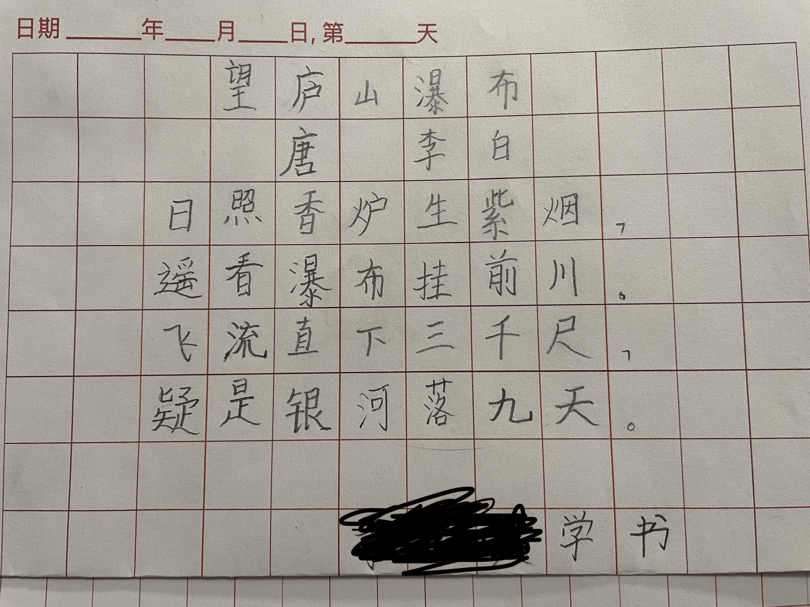

# 更新记录

|版本|更新时间|作者|说明|
|:----|:----|:----|:----|
|vA0.004|2021.2.10|李强|调整格式以便于阅读：一级接三级，四级前加点|
|vA0.003|2021.2.4|李强|MOD：调整提交截止时间（有家长回家较晚） DEL：最受关注奖（不发表看法容易获得） ADD：认真检查奖|
|vA0.002|2021.1.20|李强|ADD：附录：书写要求-图例 ADD：在线提交和表达看法-FAQ ADD：反思|
|vA0.001|2021.1.19|李强|初稿|

# 简介

寒假练字的新形式，请小朋友邀请几个同学，每天练字，内容为抄录一首诗。

### 面向小朋友的简介

1. 学习组织一次集体活动
1. 每天练字，内容为抄录一首诗
1. 展示和发现自己与朋友们的优点和进步

# 目标

### 长期目标

培养项目式学习的意识，#组织 能力

### 短期目标

1. 相互督促，每天练字
1. 分享学习成果，互相鼓励
1. 简单的组织、记录

# 项目规模

||说明|
|:----|:----|
|时间|共两期，每期 2 周|
|场地|线上异步征集参与者，线上异步交流|
|人数|4~5 人（人多不利于线上沟通）|

# 准备工作

### 人选

1. 向小朋友介绍该活动和大致流程，询问参与意愿并记录可能的建议。
1. 请小朋友列出 Ta 想邀请参与的同学，先 4 人。
1. 询问上面列出的人选的家长，介绍该活动和大致流程，询问参与意愿并记录可能的建议。
1. 如果询问后有拒绝的情况，可回到 2 一至两次，直到凑够 4~5 人（含小朋友自己）。

### 问卷

1. 和小朋友一起起草一份语音邀请，主要内容包括（尽量短且清晰）：
    1. 简单介绍该活动
    1. 介绍开始时间和大致流程
    1. 说明具体要求见给爸爸妈妈的文档
    1. 是否愿意参与（可以拒绝）；能否按时、坚持参与（每周最多请假一次；可以拒绝）
1. 请小朋友发语音给被邀请人的家长，请被邀请人语音回答并做记录
1. 如果有拒绝的情况，需根据协商结果继续或回到人选阶段

# 活动阶段

### 集合

最终产出：微信群

#### - 在线活动
阶段产出：同最终产出

流程：
1. 由组织者家长协助拉微信群
1. 由组织者宣布活动开始和第一首要抄录的诗

### 在线提交和表达看法（每天 1 次，共 2 周）

最终产出：书法作品，参与记录（谁对谁表达了看法）

#### - 技能实践
朗读，汉字书写，书法审美，正字记录法

#### - 在线活动
阶段产出：同最终产出

流程：
1. 前一天给出第二天要抄录的诗，需要说明为什么选这首诗（微信语音），比如：
    1. “明天大家要写的诗是：……朗读……，我选这首诗的原因是……”
1. 第二天所有参与者在微信群内提交抄录诗的照片（时间不限，但如果是上班或休息时间请注意不要发太多消息避免打扰）
1. 第二天 21 点前，参与者可以提交对其它人作品的看法（微信语音），形如：“我觉得 谁 的 哪个字 或 哪句话 写的不错”
    1. 由组织者集中记录“谁 对 谁 表达了看法”，A 对 B 的看法每天只记一次
    1. 参与者不能多次只对一个人表达看法
    1. 如果没有提交作品，可以表达看法，但不做记录
1. 给出今天诗的人，指定明天谁来出（微信语音）；轮流，即每个人都出过之后，才能开始下一轮
    1. 由组织者集中记录“哪天 谁 出了什么诗”
    1. 如果要请假也要担任出诗的任务
1. 给出今天诗的人，要督促所有参与者在 20 点前提交自己的作品，比如 19 点时提醒一次

参与记录：
||出题人|题目|同学 A|同学 B|同学 C|同学 D|
|:----|:----|:----|:----|:----|:----|:----|
|第一天|同学 A|题目 1|表达(次)/收到(次)|表达(次)/收到(次)|表达(次)/收到(次)|表达(次)/收到(次)|
|第二天|同学 C|题目 2|表达(次)/收到(次)|请假|表达(次)/收到(次)|表达(次)/收到(次)|
|……|||||||

（说明：表达和被表达的次数使用正字记录法）

#### - FAQ
1. 如何请假？直接在群里说即可；请注意即使请假也要完成出诗的任务
1. 如果一周请了两天假，有惩罚吗？没有，请大家自觉吧
1. 家长可以发表看法吗？除总结阶段外，尽量不要

#### - 可能的问题
1. 表达看法：遵循“yes and”原则（注意不是“yes but”），发现别人做的好的地方；如果要指出问题，可以在讲完做的好的地方之后，使用“哪一笔 或 哪个字 怎样写 会更好”的模式。
1. 表达看法：不要变成聊天。

### 在线总结 1

最终产出：第一周总结

时间：第七天

#### - 技能实践
总结

#### - 在线活动
1. 第七天（时间不限）：活动第一周最后一天的作品提交后，每位参与者选出这七天中自己提交的一幅认为最好的，说明为什么最好（微信语音）。
1. 第七天 21 点前：其它参与者自由表达看法（此阶段家长也可以表达看法）。

### 在线总结 2

最终产出：第二周总结，激励名单

时间：第十四天最后一位参与者提交作品和表达完看法后

#### - 技能实践
总结，统计，反思

#### - 在线活动
1. 同在线总结 1
1. 组织者整理表达记录，统计出激励名单：
    * 全勤（每天都有提交作品）
    * 认真检查（在全勤的基础上）
    * 表达看法最多
    * ~~最受关注（被表达看法最多）~~
1. 组织者宣布上述名单
    * 开学可获得文具类纪念品
1. 向所有参与者征集“下次活动如何做得更好”
1. 询问继续参与意愿，继续参加的可以每人再邀请一人，不限同班同学
    1. 对不能继续参加的人表示感谢
1. 向所有参与者征集下期活动组织者

# 反思

1. 组织者付出了什么，得到了什么

# 附录：书写要求

* 纸张：可以使用米字格，田字格，方格，线格或者白纸等任意纸张，要求干净无褶皱污渍
* 笔：可使用任意适合书写的硬笔，如铅笔，钢笔等
* 格式：按照学校语文课上要求的格式书写，并在最后一行居右书写：名字+学书，见下图

