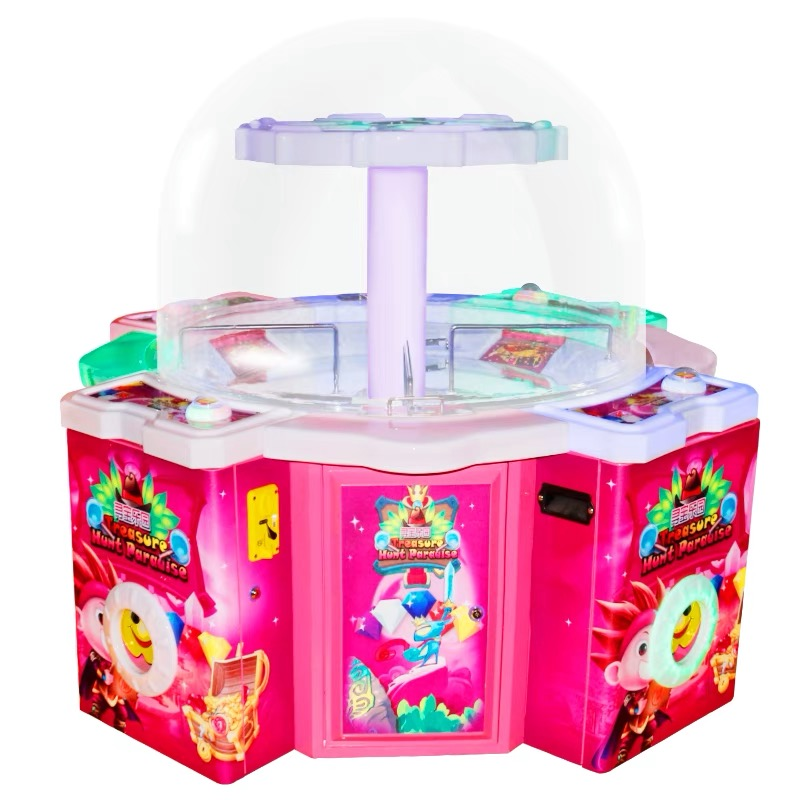
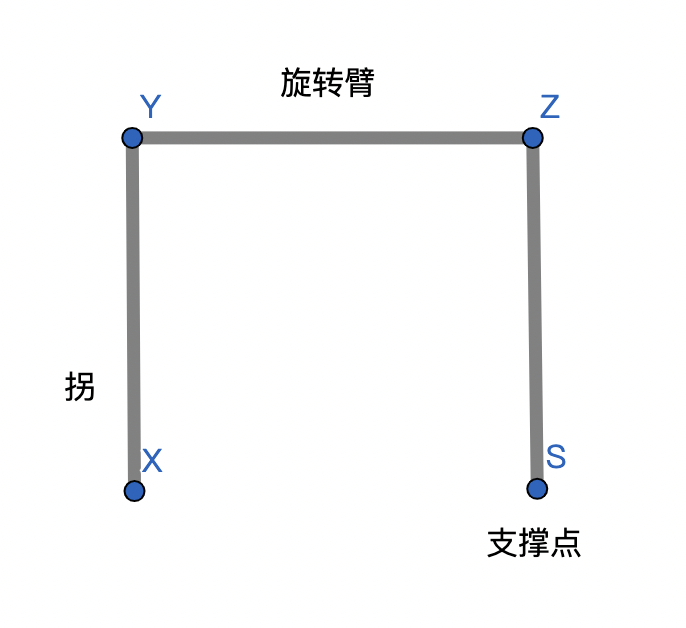
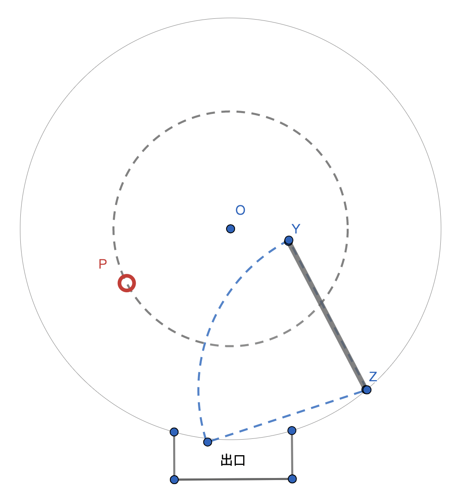
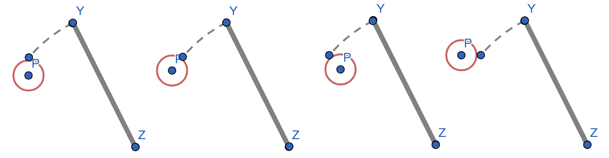
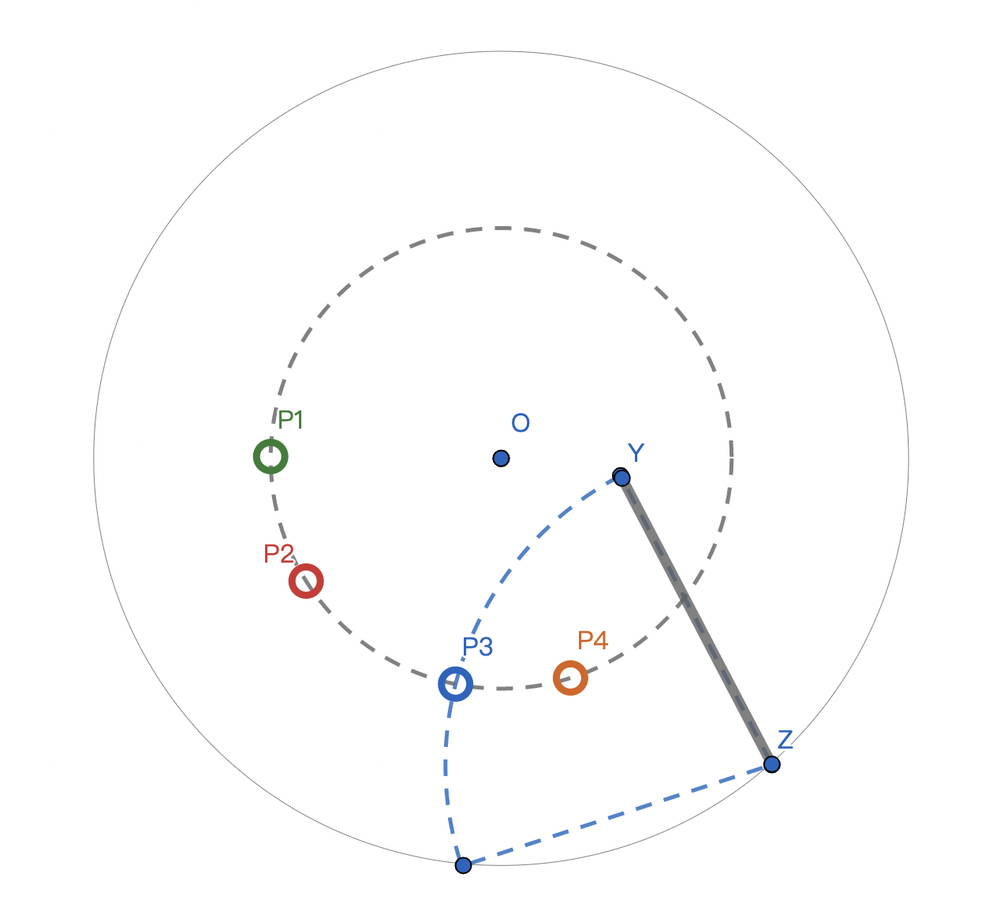
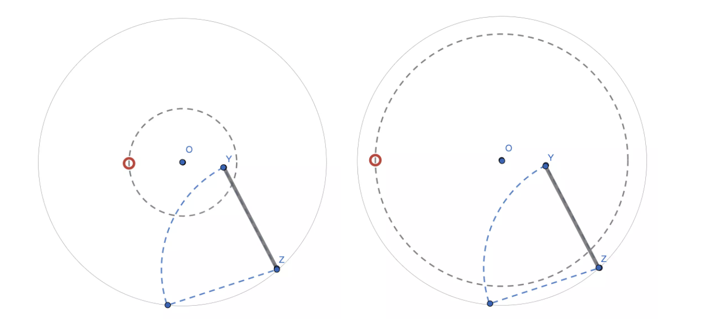

# 更新记录

|版本|更新时间|作者|说明|
|:----|:----|:----|:----|
|vA0.002|2022.3.13|李强|整理文档，补充文字和章节|
|vA0.001|2022.2.12|李强|简版，用 GeoGebra 绘制了所有图形|

# 简介

了解单拐机的基本原理（数学模型），总结操作技巧。

（说明：仅在淘宝上搜到了一个类似的机器叫“寻宝乐园”，如下图。单拐机是我起的名字，但文中会统一用这个名字；如有雷同，纯属巧合）

（图片来自淘宝网，如有侵权，请联系我删除）

## 面向小朋友的简介

1. 学习单拐机相关的数学知识
1. 应用学到的知识，发现如何玩更容易得到奖品
1. 去电玩城实践

## 多说两句

1. 本项目并不是鼓励小朋友去电玩城玩，但如果已经去过了，也不妨去思考一下游戏的规则和技巧。所有的游戏都有规则和技巧，很多其它事情也一样。
1. 即使学明白了，想在电玩城把花的钱赚回来也是不可能的！谨祝大家玩得开心。

# 目标

## 长期目标

培养项目式学习的意识，#记录，#推理，#反思 和 #抽象 能力

## 短期目标

1. 了解基本的物体运动知识
2. 实践学到的知识

# 项目规模

|时间|1 天|
|:----|:----|
|场地|任意+有单拐机的电玩城|
|人数|1 人|

# 准备工作

去电玩城玩一下单拐机

# 活动阶段

## 单拐机模型

### * 技能实践
抽象，几何-圆

### * 单拐机模型 1

1. 回忆在电玩城玩过的单拐机
1. 描述拐的构造，和每个部分的作用

### * 单拐机模型 2

1. 描述奖品（P）的运动
1. 描述单拐机按钮的作用，按下后拐的运动
1. 描述如何得到奖品

## 分层提问

### * 技能实践
测量（估计），实验，推理，物体运动

### * 提问

1. 要想把奖品推到出口，应该怎么做？

- 按下按钮，让拐撞到奖品的合适位置
- 分层提问：
    1. 什么时候按下
    1. 碰到什么位置合适

---

2. （1.1）拐碰到奖品的哪个位置更容易将奖品推向出口？

- 实验：用铅笔将透明胶圈（圆形）推向自己
- 注意：
    * 铅笔要竖直
    * 铅笔只能朝一个方向运动（模拟沿圆弧方向运动），不能发现推的方向不对了，就改变铅笔的运动方向

- 结论：根据实验结果从上图中选出最有可能的碰撞点

3. （1.2）什么时候按？奖品移动到某个位置时按下，拐刚好和奖品碰到

- 分层提问：
    1. 在哪里相碰撞
    1. 从按下到碰，拐移动了多远
    1. 从按下到碰，拐移动了多久
    1. 从按下到碰，奖品移动了多远
    1. 从按下到碰，奖品移动了多久

---

4. 奖品的运动规律是什么？
- 匀速圆周运动：一秒移动了 5 厘米，下一秒还移动 5 厘米

5. 拐的运动规律是什么？
- 匀速，沿圆弧***往复***运动

---

6. （3.1）奖品和拐在哪里相碰撞？

7. （3.2，3.3）从按下到碰，拐移动了多远，移动了多久？

- 在图中画出碰撞前拐移动了多远
- 估计（目测）移动的距离占总距离（从起点到最靠近出口）的几分之几
- 如果拐移动完总距离需要 T 秒，那么从按下到碰撞时拐移动了多少秒？

8. （3.4，3.5）从按下到碰，奖品移动了多久，移动了多远？

- 在图中画出碰撞前奖品移动了多远
- 估计（目测）移动的距离占总距离（奖品转一圈）的几分之几
- 如果奖品移动一圈需要 S 秒，那么从按下到碰撞时奖品移动了多少秒？

---

9. 从按下到碰，拐运动的时间和奖品运动的时间一样长

- 假设：
    * T = 5，从按下到碰撞用了 3 秒
- 那么：
    * 奖品也运动了 3 秒

10. 根据奖品移动了多远，反推奖品移动到哪里按按钮

- 假设：
    * S = 10，奖品移动一圈需要 10 秒
- 那么：
    * 奖品在碰撞前移动了 3/10 圈
    * 应该在碰撞点前 3/10 圈的位置按按钮

---

### * 结论

通过推理，***得到“应该在碰撞点前 ？？？的位置按按钮”的结论***

## 总结与实践

### * 技能实践
测量（估计），实验，反思-总结

### * 步骤
1. 读秒：奖品转一周需要多少秒
1. 读秒：从按下到出口，拐移动了多少秒
    * 需投币，如果有其它人玩也可以在观摩时读秒
1. 测量（估计）：估计拐和选定奖品的碰撞点，估计拐起点到碰撞点的距离
1. 计算（估计）：拐从按下到碰撞点需要移动多少久（t） -> 奖品从按下到碰撞点需要移动多久（s） -> 奖品从按下到碰撞点需要移动多远
1. 测量（估计）：按下时奖品的位置（即奖品移动到哪里时按下）

6. 模拟：在奖品移动到估计的按下位置时，开始读秒，观察 s 秒后是否移动到了估计的碰撞点
6. 调整：根据模拟结果重新估算或微调
6. Go：实际按下按钮，注意碰撞的情况和模拟的差异
6. 调整：根据实际结果重新估算或微调

## 误差

- 读秒误差：无论是计数还是用秒表，都有可能有误差，多试几次可以减少误差
- 测量误差：位置和移动多远都是估计的，会存在误差，多试几次可以减少误差
- ~~延时误差：是否按下之后拐立刻就开始移动，如果没有的话怎么办？（对哪些步骤有影响，如何消除影响）~~
- 操作误差：读秒，测量和按按钮都属于操作，波动的情绪或者注意力不集中（比如跟人聊天）都可能对操作产生影响

## 干扰

- 其它人操作干扰：如果有其它人也在同一台机器上玩，奖品的位置可能会发生变化，那么之前测量的结果可能就无效了，怎么办？
- 拐运动干扰：拐做往复运动，碰到奖品会导致奖品的位置发生变化，那么之前测量的结果可能就无效了，怎么办？

## 扩展问题

### * 按下的时机 1

提问：立刻按下，拐最有可能碰到哪个奖品？

参考答案：

- 通常 P1 和 P2 更有可能（再次强调一下不要到了 P3 再按）
- 实际上都有可能，取决于奖品的运动速度

### * 按下的时机 2

提问：两台机器如下图，一个奖品离圆心近，另一个离圆心远，想让拐能撞到奖品，哪个应该早按？

参考答案：

- 远的先按，因为拐运动到碰撞点需要的时间更长（强调一下并不是因为奖品离圆心远所以运动时间更长）

# 反思

1. 实践的结果如何，和推理得到的结论有什么不同？
1. 推理得到的结论是否有用？起到了什么作用？
1. 你得到了什么？感觉值吗？
